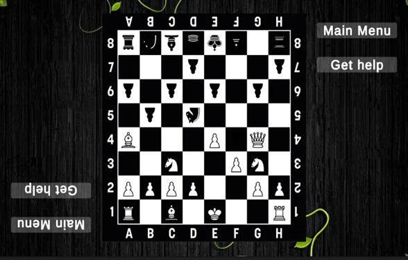

Backend for a mobile app to detect chess game state from real-life board images.
The script processes real-life chessboard images to accurately determine the game state using computer vision techniques. It employs edge detection, contour analysis, and perspective transformation to detect the board and squares, followed by piece recognition using CNNs. The extracted board state is then converted into a structured format (e.g., FEN notation) for integration with chess engine.


## Installing

1. **Using poetry (recommended).**
   Ensure you have [poetry](https://python-poetry.org) installed, then clone this repository, and install intellichess:
   ```bash
   git clone 
   cd intellichess
   poetry install
   ```

### Downloading the dataset and models

To download and split the dataset, run:

```bash
python -m intellichess.data_synthesis.download_dataset
python -m intellichess.data_synthesis.split_dataset
```

Finally, ensure that you download the trained models:

```bash
python -m intellichess.occupancy_classifier.download_model
python -m intellichess.piece_classifier.download_model
```


## Acknowledgments

This project is heavily inspired by the work of [@georg-wolflein](https://github.com/georg-wolflein). Their insights, guidance, and previous work have played a crucial role in shaping this repository. I highly recommend checking out their work [here](https://github.com/georg-wolflein/chesscog).

